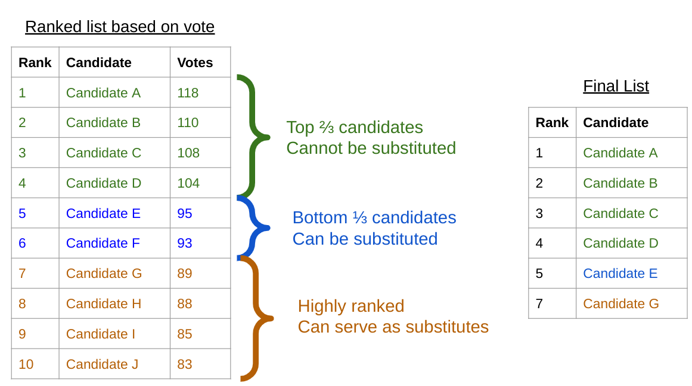

# Committee Membership and Renewal Policy

| Version | Date Updated | Description of Changes           |
| ------- | ------------ | -------------------------------- |
| 1.0     | May 23, 2025 | Ratified by Governance Committee |
|         |              | 
 
                      |

As of April 1, 2025, CSIDNet has 8 network committees with 44 members who have committed to serve until July 2025 upon which we will determine term limits. To involve as many members as possible in our planning and operational work, we initially filled committees on an open, voluntary basis. Over time, committees will be populated on a rolling basis through an application process, with the Governance and Advisory Committees elected by the full membership. This document details the process for committee renewal and membership, both elected and non-elected. Each non-elected committee will have a flexible size, with a minimum of 3 and a maximum of 10 members. Elected committee sizes are dependent on the committee. Meeting schedules will be determined by members based on the needs of the committee’s work.

1. #### Member Eligibility

Members must remain in good standing with CSIDNet at the time of their appointment and throughout their term to be eligible for appointment to a committee. 

Diversity of disciplines, geography, institutions, and career stages is encouraged and overseen by the Appointment Committee (see Sec. 2).

2. #### Appointment process

The appointment process is how members will join a committee. Depending on the committee, this is done either through a nomination or an election process.

A proposed timeline for the appointment process is provided in the Appendix. 

**2.1 The Appointment Committee**

The appointment process is overseen by an ad hoc Appointment Committee consisting of one currently serving member of each committee. This committee representative is chosen by their own committee following a decision-making process of their choosing the September before elections are held. The Appointment Committee is responsible for managing the appointment logistics in collaboration with CSIDNet staff, reviewing nominations and sorting people into committees, and overseeing the election process for elected committees. The ad hoc committee will meet once before elections to review the nomination forms and discuss their recruitment priorities for the upcoming term. The committee will meet as needed post-election to sort people into non-elected committees and validate elected committee member lists.

**2.2 Nominated Committees**

For non-elected committees, appointments result from nominations for membership, following a call for new committee members three months prior to the end of a committee term. Nominations may be self or by other CSID network members. Members can be nominated for multiple committees. All nominees will submit a 2-3 sentence response detailing their experience and interest in the committee, to be used by the Appointment Committee to help with placement. A skills survey may also be required. The Appointment Committee will then sort the nominees into committees with a preference for geography, career stage, relevant experience, and disciplinary diversity within the committee with help from the Membership Staff.

**2.3 Elected Committees**

Several committees that oversee governance processes or staff have been decided to be elected committees who will be elected by CSIDNet Members.&#x20;

The Governance Committee is an elected committee with six (6) members. The nomination form will include a skills survey and request for a 2-3 sentence statement which will be shared with CSIDNet during the voting process.

The Advisory Committee is an elected committee with a minimum of three (3) members. The nomination form will include a request for skills survey and a paragraph detailing the candidate’s prior experience with serving on boards, mentorship, and managing supervisees, both within the CSIDNet and externally.

During the voting process, CSIDNet members will be asked to vote for the number of candidates equivalent to the committee size,  explicitly considering the candidates’ experience as well as the representativeness of the group of candidates they have chosen (e.g. do they represent the diversity of the wider CSIDNet body). The candidates will then be ranked based on the number of votes they receive. The Appointment Committee will review the list of the top ranked candidates equivalent to the committee size for representativeness following the [CSIDNet Representativeness Statement](https://docs.google.com/document/d/1_-tw8BL-NY9_cf9SLh0fKN5NSUHfIeGI9UzgWdHmwUo/edit?usp=sharing). If the proposed committee member list is judged to be representative, the Appointment Committee can validate the list of committee members based on the voted ranks. However, if the proposed committee member list is not representative of the wider CSIDNet community, the Appointment Committee can choose to substitute some of the potential members with other highly ranked candidates as per the process detailed in the Appendix.

3. #### Term Limits

**3.1 Standard Term Length and Rotation Cycle**

Term limits are for a period of two (2) years, to begin in January.&#x20;

Outgoing members are encouraged to participate in onboarding new members during the preceding transition period of up to three months (Oct - Dec). During this observation period, incoming members may attend meetings but cannot vote and their presence does not contribute to quorum.

**3.2 Term Limitations**

Members may serve a maximum of two consecutive terms on the same committee.&#x20;

After serving two terms, a member may serve immediately on another committee, but must take a minimum one year break before being eligible for reappointment to the same committee.

4. #### Vacancies and Resignations

**4.1 Voluntary Resignation**

Members may opt to resign from a committee if they are no longer able to actively participate. Resignation must be submitted to the Governance Committee.

**4.2 Membership Removal**

Committee members can be removed from a committee for [Code of Conduct](https://docs.google.com/document/d/1j2-KdBTIrEuAu8mVE30oXeMFy9OcE-CDsyCuRaLIFjE/edit?usp=sharing) violations. This process is overseen by the Governance Committee.

Committee members can be removed from a committee for absenteeism. Generally, this is defined as missing three (3) consecutive meetings, but exceptions can be made when members are able to contribute to committee responsibilities asynchronously. It is the responsibility of each committee to track committee member attendance themselves. The process for removal for absenteeism is initiated by the committee in question, and committee members are encouraged to opt for voluntary resignation when commitments cannot be met. In the case of non-voluntary resignation (e.g. Code of Conduct violations, absenteeism, etc.), a majority vote of 50% of all members in the respective committee is required to remove a member.

**4.3 Filling Vacancies**

If a vacancy occurs mid-term for non-elected committees, the committee may decide to fill the position for the remainder of the term through an open call for self-nomination, managed by the committee in question. The existing current members of the respective committee will choose a new member from the list of nominees through a decision making process of their choosing.

If a vacancy occurs mid-term for elected committees, the vacancy can either remain unfilled or be filled by calling for an ad hoc election, following the election process detailed above. Whether to fill the vacancy is at the discretion of the committee in question. When an ad hoc election is called for, the Governance Committee will oversee the election.

Partial terms do not count toward the term limit.

5. #### Exceptions

Exceptions to term limits and committee membership requirements may be granted in exceptional circumstances (e.g. during transition phases). These exceptions must be documented and submitted to the Governance Committee for approval.

6. #### Amendment and Review

This policy shall be reviewed every five (5) years or as needed by the Governance Committee. Amendments are ratified via a network-wide referendum.

#### Appendix

**List of Committees**

Governance Committee (Elected Committee)

* Purpose: to ensure good governance through maintaining and improving the governance structures and practices of the CSID Network.&#x20;
* Early Work/Responsibilities: support creation of network membership agreement; interim structure feedback and re-design; setting committee term limits; determining committee meeting and reporting schedule/format; determining need for and creation of ad hoc committees; supporting the Representative Council in determining reporting schedule/format; supporting the creation of accountability, conflict, and feedback systems; collaborate with Training & Education committee to plan for working group participatory grantmaking process; other governance issues as raised by staff and/or broader membership

Advisory Committee (Elected Committee)

* Purpose: to provide guidance and oversight of the CSIDNet’s staff and operations and regularly review updates from CSIDNet staff, discuss improvements and ensure staff work plans align with Network strategy and goals. Currently hold fiduciary responsibility as signatories with the fiscal host.
* Early Work/Responsibilities: Contribute to the development of a staff accountability plan that outlines clear performance expectations and feedback mechanisms; provide strategic oversight and input on staff hiring processes, including reviewing job descriptions and supporting leadership in decision-making; offer mentorship and guidance to staff, helping to build leadership capacity and foster professional growth; advise on role definitions and team structure to ensure clarity, equity, and alignment with organizational goals; support the cultivation of a healthy organizational culture rooted in the CSIDNet mission and values.

Memberships & Partnerships

* Purpose: to facilitate a positive CSID Network member experience, with a focus on new member recruitment, onboarding and offboarding, and building and maintaining beneficial CSID ecosystem relationships and partnerships.
* Early Work/Responsibilities: new and potential member 1:1s; helping to shape interim and final new member process (application creation, approach to application deadlines, process for assigning and onboarding new members to committees and working groups); supporting the development of network onboarding materials; curating virtual programs and events to engage current members, potential members, and ecosystem peers; collaborating with the Governance Committee to collect feedback on member needs and experience; channel member feedback to relevant committees, working groups, and staff.&#x20;
* Other Notes: Likely to field event sponsorship requests (responsible for gut/strategic alignment check before confirming with F\&F committee if there’s a financial component)&#x20;

Training & Education&#x20;

* Purpose: to develop and coordinate training and education opportunities for CSID Network members
* Early Work/Responsibilities: help develop “core curriculum” for network members; in collaboration with the Memberships & Partnerships Committee and the Representative Council, create processes for regularly assessing membership growing edges and opportunities for skill development; support the curation of relevant virtual network events and programming&#x20;
* Other Notes: Functions as “culture keepers” in partnership with the Governance Committee.  It would be ideal to have some working group members and/or broad network members with a tools development background as well to balance attention to “soft” and “hard” skills.

Fundraising & Finance

* Purpose: to facilitate the responsible raising and stewardship of CSID Network funds
* Early Work/Responsibilities: support the development of financial transparency policies; support network grant writing and fundraising efforts; collaborate with the Training and Education committee to develop an approach for building broad network capacity to interpret relevant financial statements, understand the financial position of the network, and make informed monetary decisions; in collaboration with Interim Managing Director, support the tracking and management of the network’s current budget and the creation of a member driven budgeting process in Year 2
* Other Notes: Will be important to differentiate what tasks are being directed by and/or bottom-lined by staff vs. committee members. &#x20;

Communications

* Purpose: to direct external communications work, and writing about the CSID Network and the broader CSID field.
* Early Work/Responsibilities: drafting SOW for communications strategy consultant and facilitating the selection and onboarding of a comms consultant; supporting the documentation of network activities and processes; authoring and curating the publishing of public-facing blog posts and articles; connecting the network to researchers and outlets with an interest in our approach to and/or outputs of our community of practice.
* Other Notes: Will likely be inactive/less active until our work begins in earnest!&#x20;

Gatherings & Events

* Purpose: to support the planning of CSID Network annual gatherings and events
* Early Work/Responsibilities: July 2025 Annual Event planning; working with Collaborative Committee to support regional Fellow events, as needed; working with Interim Managing Director to support other regional events, as needed; collaborating with the Training & Education committee and Membership & Partnership committee to host/support virtual events
* Other Notes: May have subgroups focused on specific events. Likely to have surges and dips in activity based on events schedule. Eventually will grow into reviewing applications for annual gatherings.

Collaborative Committee

* Purpose: to mentor, support, and coordinate programming for the incoming CSID Network Fellowship cohort
* Early Work/Responsibilities: Phase 1- Selection Committee reviews Expressions of Interest, creates shortlist, reviews full applications, interviews final candidates with Advisory Committee members, and selects final fellows with Advisory Committee members; Phase 2- Interested members of the Selection Committee and appointed Collaborative Committee members will work with Interim Managing Director, relevant consultants, and the Training and Education Committee to design Fellowship programming (monthly meetings, events, structure for support and mentorship)
* Other Notes: The process for joining the Collaborative Committee may or may not align with other committee processes in both interim and final forms. Members of Phase 1 of this committee have been appointed by the Interim Managing Director and offered a $500 honorarium. Members of Phase 2 will likely be based on need and qualifications/experience that would be most supportive to selected fellows.

**Appointment Process Timeline**

| Time Period            | Appointment Process Steps                                                                                                                                                                                                                                                                         |
| ---------------------- | ------------------------------------------------------------------------------------------------------------------------------------------------------------------------------------------------------------------------------------------------------------------------------------------------- |
| Beginning of September | <ol><li>Governance Committee sends out a reminder for committees to choose their representative for the Appointment Committee (ApptComm)</li></ol>                                                                                                                                                |
| Early October          | <ol><li>ApptComm reviews nomination forms</li><li>ApptComm sends out call for nominations to CSIDNet</li></ol>                                                                                                                                                                                    |
| End of October         | <ol><li>ApptComm distributes a list of nominees to be voted on for electable committees. Allow two weeks for voting process</li><li>ApptComm reviews nominations and sorts nominees into non-electable committees</li><li>ApptComm reviews and validates elected committee member lists</li></ol> |
| November               | <ol><li>ApptComm announces new committee members</li><li>New committee members can begin attending committees as non-voting members</li></ol>                                                                                                                                                     |
| January                | <ol><li>Turnover of committees to new members</li></ol>                                                                                                                                                                                                                                           |

**Process to Validate Elected Committee Membership Lists**

To ensure that the elected committees represent the make-up of the wider CSIDNet community, the Appointment Committee follows a process to validate and/or change elected committee lists. This process is detailed below:

Following elections, a list of candidates and the number of votes each received will be reviewed by the Appointment Committee. They will review the top ranked candidates equal to the size of the committee being considered (e.g 6 or 3). They will then decide as a group if this list of potential committee members is representative of the CSIDNet community, following CSIDNet’s Statement on Representation:

1. If the potential committee member list chosen through the ranked list of candidates based on the voting is judged to be representative, the Appointment Committee will validate this list of members.
2. If the potential committee list chosen through the ranked list of candidates based on the vote is judged to not be representative, the Appointment Committee can choose to replace the third of members who received the lowest votes with other highly ranked candidates to improve representativeness. For example:

  \
For updates see [this document](https://docs.google.com/presentation/d/1qJWyhIgg494JwEx6cAFHaYBdB0ZYJdZooFfNgCHRI3s/edit?usp=sharing)

The above scenario is an example for an elected committee with 6 members. Following the vote, the Appointment Committee reviews the list of the top 6 candidates and assesses the representativeness of this potential committee. They determine that the potential committee is too homogeneous following the voted list and decide to substitute one of the potential members with another highly ranked candidate. Candidates A-D (in green) are in the top ⅔ of the member list and cannot be substituted. Candidates E-F (in blue) are in the bottom ⅓ and can be substituted by another highly ranked candidate (in orange). The Appointment Committee decides to substitute Candidate F with Candidate G for the final committee membership list.
