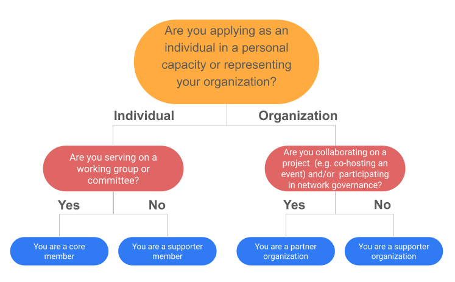

# Membership Framework

<figure><figcaption>
Decision tree for membership categories
</figcaption></figure>

### Membership Eligibility Requirements

CSID Network (CSIDNet) is a voluntary community of Climate Sensitive Infectious Disease (CSID) researchers and practitioners, united to collaborate on the co-design, development, and maintenance of CSID tools that are relevant, accessible, and impactful. CSIDNet is coordinated by a small staff and member-leaders.&#x20;

Membership consists of four categories: **Core Member, Partner Organization, Supporter Member, and Supporter Organization**.&#x20;

If you are a stakeholder represented in one of the groups listed below, have attended at least one CSIDNet event (including online), and are excited by and committed to our network values, you are eligible to become a member. Enrollment is open on a rolling basis, with quarterly onboarding sessions hosted by the Membership & Partnerships Committee.

Most CSIDNet Members identify as:

* Researchers (e.g., epidemiologists, modelers, climatologists, health scientists)
* Software developers and data experts (e.g. data scientists, research software engineers)
* Public Health Officials (e.g., government agencies, and health ministries)
* CSID software tool users including healthcare practitioners, policymakers, NGOs, international organizations, citizen scientists and activists
* Environmental and climate experts (e.g., environmental scientists, climate modelers, climate activists)
* Community non-profit organisations, or civil society organisations.

### Member Participation Requirements

The CSID Network is a collaborative space where members actively contribute to the co-design, development, and sustainability of CSID tools. Participation levels vary by membership category, but all members are expected to engage meaningfully in the network’s activities and uphold its core values.

#### General Participation Expectations

All CSID Network members are expected to:

* **Engage in Network Activities** – Attend relevant meetings, events, and discussions to stay informed and contribute to ongoing initiatives; share feedback to improve network activities.
* **Contribute Expertise and Insights** – Share knowledge, experiences, and best practices relevant to CSID research, tool development, or community-building efforts.
* **Respect Collective Decision-Making** – Support democratic governance and shared leadership within the network.
* **Uphold CSID Network Values** – Actively promote equity, collaboration, and knowledge-sharing in all interactions.
* **Maintain Open and Reciprocal Collaboration** – Foster partnerships based on mutual aid and respect, avoiding extractive or transactional relationships.

**Code of Conduct**&#x20;

To support a safe and welcoming environment, all members agree to follow CSDINet’s [Code of Conduct](code-of-conduct.md). The Code of Conduct outlines expected behavior for all participants. Violations, following an investigation by the Governance Committee, may result in loss of membership. Concerns can be reported to the Advisory Committee at [advisory@csid-community.groups.io](mailto:advisory@CSID-community.groups.io).

### Membership Categories, Participation Requirements & Benefits

CSIDNet membership includes four categories, each reflecting a different level of commitment and engagement. Individuals and organizations may only hold one membership type at a time. Membership dues are outlined in the following section.

#### Core Members

_Active leaders serving on a Committee or Working Group, and shaping the governance, strategy, and activities of CSIDNet._

**Expectations**:

* Serve on at least one committee or working group.
* Support member-driven decision making by voting on key decisions and governance matters.
* Attend regular meetings, contribute to initiatives, and mentor newer members when possible.

**Benefits**:

* Voting rights on governance and network-wide decisions (e.g. working group selection, elected committees, strategic direction).
* Eligibility for leadership roles (e.g., ad-hoc committees, initiative leads).
* Priority access and free or discounted invitations to events, workshops, programs, and other opportunities (dependent on budget).
* Access to training, mentorship, and peer learning opportunities.
* Opportunities to co-author publications, present at events, or represent the network.
* Recognition on CSDINet website, newsletters, and public materials (e.g. featured profiles).

#### Partner Organizations

_Institutions formally supporting and amplifying CSIDNet’s mission by contributing resources such as data, co-funding, expertise, or event hosting._

**Expectations:**

* Appoint up to three representatives.
* Contribute in-kind support (e.g., event hosting, training facilitation, technical input).
* Share relevant tools, platforms, or research.
* Encourage individual staff participation in CSIDNet activities (e.g., working groups, webinars, training), recognizing that these individuals may also hold Core Member status in their personal capacity.

**Benefits:**

* One organizational vote via a designated representative. &#x20;
* Co-branding and logo placement on CSIDNet publications, websites, and events.
* Ability to co-host or sponsor events; reduced event sponsorship rates, and discounted participation fees for their members.
* Invitation to participate in collaborative proposals and joint funding applications.
* Co-designing training and event series.
* Showcasing of institutional work through blog features, webinars, or spotlight sessions.
* Priority access to recruit fellows or collaborators from within the network.
* Networking opportunities with other partner and supporter organizations.&#x20;

#### Supporter Member

_Engaged participants who contribute to learning and knowledge exchange without governance responsibilities._

**Expectations:**

* Attend CSIDNet events and participate in knowledge-sharing discussions.
* Share relevant resources or insights with the broader network.
* Help grow the network by inviting others and sharing opportunities.

**Benefits:**

* Access to events, webinars, and community platforms.
* Subscription to the CSIDNet newsletter.
* Invitations to informal networking spaces, community calls, and training opportunities.
* Recognition as a network supporter on the website, including spotlight opportunities.&#x20;
* Opportunities to join working groups or committees when space and interest align.
* Free or discounted access to select CSIDNet events.

#### Supporter Organizations

_Allies and amplifiers of CSIDNet’s mission through advocacy and informal support, and who wish to contribute to CSIDNet’s sustainability and growth._

**Expectations:**

* Align with CSIDNet’s values and mission.
* Promote CSIDNet events and opportunities within their networks.

**Benefits:**

* Recognition as a supporter organization on the website.
* Invitations to CSIDNet selected events (space permitting).
* Opportunity to co-promote initiatives or tools with the CSIDNet brand.
* Reduced event sponsorship rates and discounted participation fees for their members.
* Visibility through cross-promotions (e.g., shared blog posts, co-curated resources).
* Networking with other partner and supporter organizations.&#x20;

### Who participates in decision-making?

Network-wide decisions, such as working group selection or committee elections, are voted on by membership tiers that contribute to CSIDNet’s governance:&#x20;

* Core members (1 vote each)
* Partner organizations (1 vote per organization)

Partner Organizations’ votes via representatives reflect an institutional perspective, while individual members (including those affiliated with partner organizations) retain their personal voting rights as Core Members. This ensures balanced representation without duplicating influence.

### Application & Review of Membership Status

**Application & Onboarding Process**\
Prospective members can apply through an online form on the CSIDNet website. Applications are reviewed on a rolling basis by the Membership & Partnerships Committee. The onboarding process includes:

* A brief orientation on CSIDNet’s mission, structure, and expectations, in quarterly onboarding calls.&#x20;
* Access to communication channels and onboarding materials.

Partner and supporter organizations undergo additional review by the Membership & Partnership Committee and staff to ensure alignment with CSIDNet’s missing and to avoid conflicts of interest. Partner status is formalized by the Memberships & Partnerships Committee following staff evaluation.&#x20;

### Dues Schedule

Membership dues help sustain CSIDNet’s activities while keeping participation accessible. Dues vary by membership type to ensure contributions align with members’ involvement. Funds support community engagement, capacity building, shared digital infrastructure, and open access resources.&#x20;

Dues are paid annually at the start of each membership cycle, which runs from January to December every year. Members will receive reminders before renewal deadlines.

1. **Core Member**
   1. Annual Dues: $0 USD
2. **Partner Organization**
   1. Annual Dues: With generous support from our sponsors, Partner Organization fees are waived for 2026, but we still welcome voluntary contributions.&#x20;
3. **Supporter Member**
   1. Annual Dues:

| 
 
 | High Income Countries (HIC) | Low and Middle Income Countries (LMIC) |
| ----------- | --------------------------- | -------------------------------------- |
| Standard    | $50 USD                     | $20 USD                                |
| Student     | $20 USD                     | $15 USD                                |
|             |                             |                                        |

4. **Supporter Organizations**
   1. Dues vary by organizational size and income level.

| Organization Size    | High-Income Countries (HIC)         | Low- and Middle-Income Countries (LMIC) |
| -------------------- | ----------------------------------- | --------------------------------------- |
| Small (<15 staff)    | $250 USD                            | $100 USD                                |
| Medium (15–50 staff) | $400 USD                            | $200 USD                                |
| Large (>100 staff)   | $750 USD                            | $500 USD                                |
| Private sector       | $1,000–$1,500 USD (suggested range) | $750–$1,000 USD (suggested range)       |

***

This Membership Framework reflects CSIDNet’s commitment to transparent, inclusive, and member-led governance. The Membership and Partnership Committee will regularly review and update this document based on feedback from members to ensure our policies remain clear and supportive of our shared goals.&#x20;
